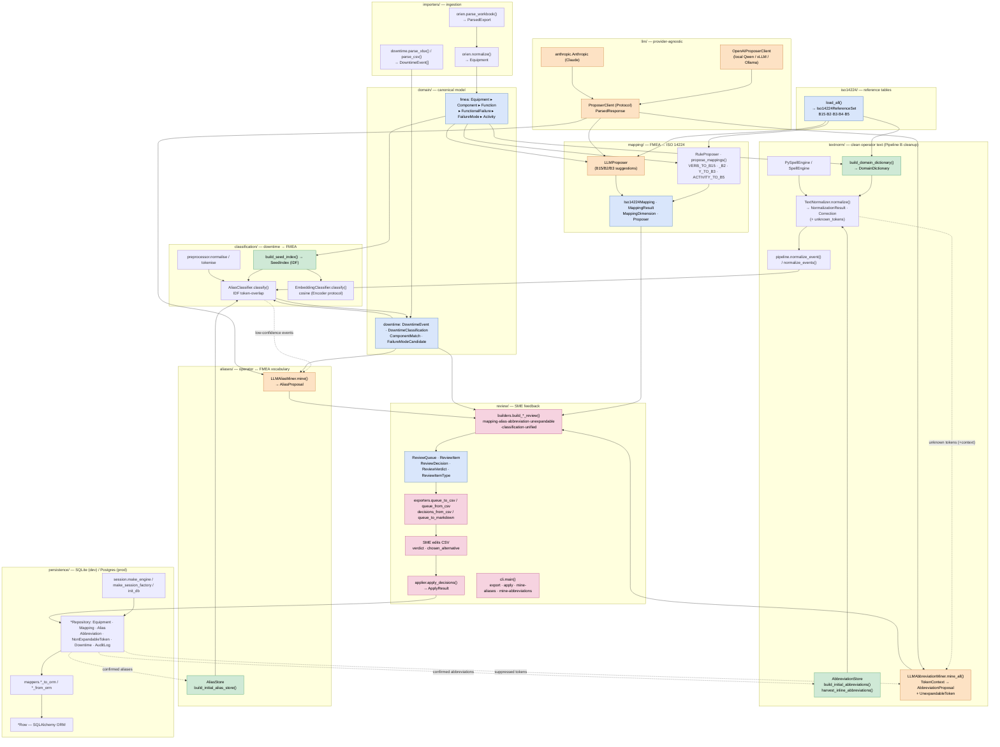

# Code Map — implemented modules & functions

A map of what is **actually built** in `src/orien_import_tool/` (the
higher-level intended design lives in [`architecture.md`](architecture.md)).

Two pipelines over a shared canonical model, with an SME review layer that
persists confirmed knowledge and feeds it back so each run starts cleaner:

- **Pipeline A** — import an Orien Tactics FMEA export → canonical `Equipment`
  → map failure modes / activities to ISO 14224.
- **Pipeline B** — import noisy operator downtime text → clean it → classify it
  against the FMEA → route low-confidence results to SME review.
- **Feedback loop** — SME decisions persist (aliases, abbreviations, suppressed
  tokens) and rehydrate into the stores the normaliser/classifier use.

## Module / function index

Every public class (`C`) and function (`f`), by package.

### `importers/` — ingestion adapters
- **orien/parser.py** — `f parse_workbook`; `C OrienParseError, ParsedHeader, ParsedExport`
- **orien/normalizer.py** — `f normalize` (ParsedExport → `Equipment`)
- **orien/schema.py** — column contract for the Orien export
- **downtime/excel_adapter.py** — `f parse_xlsx, list_sheets`; `C DowntimeExcelError`
- **downtime/csv_adapter.py** — `f parse_csv`; `C DowntimeIngestError`

### `iso14224/` — reference tables
- **loader.py** — `f load_all, load_failure_modes, load_failure_mechanisms, load_failure_causes, load_detection_methods, load_maintenance_activities`; `C Iso14224ReferenceSet, IsoLoadError`
- **models.py** — `C Iso14224FailureMode, …FailureMechanism, …FailureCause, …DetectionMethod, …MaintenanceActivity`

### `domain/` — canonical dataclasses
- **fmea.py** — `C Equipment, Component, Function, FunctionalFailure, FailureMode, Activity, ActivityLabour, ActivityMaterial, ActivityCost`
- **downtime.py** — `C DowntimeEvent, ComponentMatch, FailureModeCandidate, DowntimeClassification`

### `textnorm/` — operator-text cleanup
- **dictionary.py** — `f build_domain_dictionary`; `C DomainDictionary`
- **spell_engine.py** — `C SpellEngine (Protocol), PySpellEngine`
- **abbreviations.py** — `f build_initial_abbreviations, harvest_inline_abbreviations`; `C Abbreviation, AbbreviationStore, AbbrevProposer`
- **normalizer.py** — `C TextNormalizer, NormalizationResult, Correction`
- **pipeline.py** — `f normalize_event, normalize_events`
- **miner.py** — `C LLMAbbreviationMiner, TokenContext, AbbreviationProposal, AbbreviationProposalBatch, UnexpandableToken, AbbreviationMiningResult`

### `aliases/` — operator↔FMEA vocabulary
- **models.py** — `C Alias, AliasProposer`
- **store.py** — `C AliasStore`
- **seed.py** — `f build_initial_alias_store`
- **miner.py** — `C LLMAliasMiner, AliasProposal, AliasProposalBatch`

### `mapping/` — FMEA → ISO 14224
- **rules.py** — `f normalise`; lookup tables `VERB_TO_B15, VERB_TO_B2, Y_TO_B2, Y_TO_B3, ACTIVITY_TO_B5`
- **proposer.py** — `f propose_mappings`; `C RuleProposer`
- **llm_proposer.py** — `C LLMProposer, FailureModeProposal, B15Suggestion, B2Suggestion, B3Suggestion`
- **models.py** — `C Iso14224Mapping, MappingResult, MappingDimension, Proposer`

### `classification/` — downtime → FMEA
- **preprocessor.py** — `f normalise, tokenise`
- **seeds.py** — `f build_seed_index`; `C SeedIndex`
- **alias_classifier.py** — `C AliasClassifier` (IDF token-overlap; optional normalizer + alias store)
- **embedding_classifier.py** — `C EmbeddingClassifier, Encoder (Protocol)` (cosine similarity)

### `llm/` — provider-agnostic client
- **protocols.py** — `C ProposerClient (Protocol), ParsedResponse`
- **openai_compat.py** — `C OpenAIProposerClient` (vLLM/Ollama/Qwen; `extra_body`, thinking toggle)

### `review/` — SME review queue
- **builders.py** — `f build_mapping_review, build_alias_review, build_abbreviation_review, build_unexpandable_review, build_classification_review, build_unified_queue`
- **models.py** — `C ReviewItem, ReviewDecision, ReviewVerdict, ReviewItemType, ReviewQueue`
- **exporters.py** — `f queue_to_csv, queue_from_csv, decisions_from_csv, queue_to_markdown`
- **applier.py** — `f apply_decisions`; `C ApplyResult`
- **cli.py** — `f main` (subcommands: `export`, `apply`, `mine-aliases`, `mine-abbreviations`)

### `persistence/` — SQLAlchemy 2.x
- **models.py** — `C EquipmentRow, ComponentRow, FailureModeRow, Iso14224MappingRow, AliasRow, AbbreviationRow, NonExpandableTokenRow, DowntimeEventRow, DowntimeClassificationRow, AuditLogRow`
- **mappers.py** — `f equipment_to_orm/_from_orm, mapping_*, alias_*, abbreviation_*, downtime_event_*, classification_*`
- **repositories.py** — `C EquipmentRepository, MappingRepository, AliasRepository, AbbreviationRepository, NonExpandableTokenRepository, DowntimeRepository, AuditLogRepository`
- **session.py** — `f make_engine, make_session_factory, init_db`
